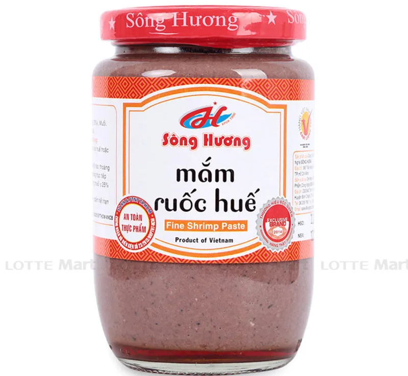
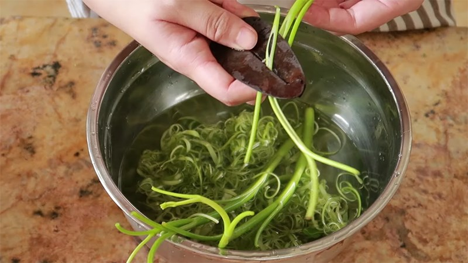

# Bun Bo Recipe

**Wash the meat 🥩🍖**

- 5L of water
- 5kg port trotters (optional)
- 5kg beef bones
- 2 Beef ribs
- Beef shank, brisket, tendon (can just pick anything you like)
  Boil them for 20 minutes, then rinse them with water again.

**Grilled**

- 5 onions
- 7 shallots
- 1-2 gingers
- Grill them on pan or directly on stove, or in air fryer

**Broth making**

- 9L of water into a big pot
- Into the water
  - Clean Bones and meat
  - Grilled onions, shallots, ginger
  - 2 tsp of salt
  - Rock sugar (a few pices)
  - 1 bowl of fish sauce 🐟
- Once it boils, there will be dark bubbles on the surface. Turn down the heat to minimal so the bubbles won’t disperse into your broth. Use a sieve sifter to get them out of your broth completely
- Put 12 beaten lemon grass into the broth
- Leave it for 6 hours on low heat
- Take your pork and beef out and slice into edible pieces

**Shrimp paste (mắm ruốc)**
Be careful not to mistaken it with mắm tôm (another kind of shrimp paste)

- 1 tsp of mắm ruốc in a big bowl of warm water
- Leave it for 1 hour for the residue to settle at the bottom
- Put the top clean layer of your bowl of mắm ruốc into your broth (now in the making)

**Annatto oil**
Can buy or make it yourself

When to put annatto oil into your broth: after the broth is entirely done.

Probably important notes: some other recipes will tell you to caramelize minced shallots and onions in hot annatto oil, together with dried chili flakes and/or chili powder, then put it into the broth before it is boiled, but my mom critiques that it would make the broth not clear (eg. having dark color) once it is done.

**Other possible toppings**

- Pork blood
- Chả Huế (pork sausage)
  
- Chả cua (crab sausage): there are 2 kinds of crab sausage I've seen. The first one is typically available in Vietnamese markets, but I doubt you can find it where you live. We can look up the recipe for crab sausage later :)
  
  

**Sate chili oil**
Can buy or make it yourself

- 80ml cooking oil
- 20g minced lemongrass-
- 20g minced shallot
- 20g minced garlic
- 30g minced chili
- 1 tsp chicken powder
- 1 tsp fish sauce
- 20ml annotto oil

Put it in your bowl of bun bo when you serve it, cause putting it into your entire pot of broth is a crime to people who can't tolerate spiciness 😒

**Greens 🥬🍃**

- Thai Basil
- Coriander
- Saw leaves
- Spring onion
- Onions
- Sliced morning glory (it might be hard to find this in your supermarkets. you wouldn’t wanna slice it yourself cause it takes time 😛 tho I found this [tool](https://www.lazada.vn/products/dung-cu-che-rau-muong-dao-che-rau-muong-sieu-sac-i1517255250.html) that could be helpful to do it)
  
- Sliced banana blossom
  

Good luck! 😘
